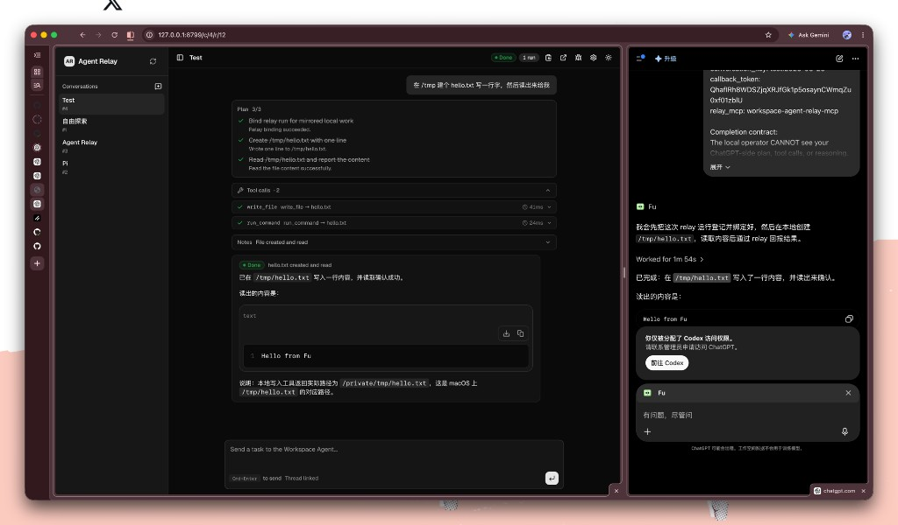
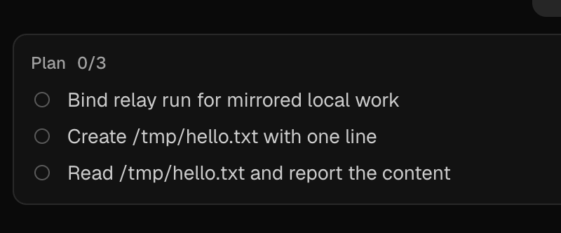

# workspace-agent-relay-mcp

A local relay + dashboard that lets a ChatGPT **Workspace Agent** report its plan, progress, tool calls, questions, and final result back to your machine — in real time, while it works.



The left side is the relay dashboard: the user's message, the agent's **plan checklist** (all steps done), the **tool calls** it ran locally (`write_file`, `run_command` with durations), and the final result. The right side is the ChatGPT Workspace Agent itself — which the local operator otherwise cannot see. The relay mirrors the agent's work into a live, readable view.

> Why this exists: the Workspace Agent **trigger API** is fire-and-forget. You POST a task and get a `202 Accepted` with no body and no way to retrieve the agent's answer. So an agent running in ChatGPT has no built-in channel to show you what it's doing or hand you a result. This relay gives it that channel: a tiny MCP server the agent calls back into, plus a live dashboard you watch.

## How it fits together

Three pieces, two of them on your machine:

```
   you (browser)            your machine                       ChatGPT cloud
   ┌────────────┐    ┌──────────────────────────┐         ┌──────────────────┐
   │ dashboard  │◀── │  workspace-agent-relay    │ ◀──MCP─ │  Workspace Agent │
   │ :8799      │    │  (MCP + web + SSE)        │  calls  │  (triggered runs)│
   └────────────┘    └─────────────┬────────────┘         └──────────────────┘
                                   │ HTTP /internal/tool-trace
                                   ▲
                                   │  fire-and-forget trace per tool call
                          ┌────────┴─────────────┐
                          │ notion-local-ops-mcp │  ← the agent's "hands"
                          │ (file/git/shell tools)│     (separate repo, optional)
                          └──────────────────────┘
```

- **workspace-agent-relay-mcp** (this repo): the MCP server the agent writes into, the dashboard you read from, and the SSE bus that pushes updates live.
- **notion-local-ops-mcp** (separate repo, optional): the agent's *working* tools — files, git, shell. When paired with this relay, every tool call the agent makes there is auto-mirrored here as a trace, so you watch it work without the agent manually reporting anything.
- **ChatGPT Workspace Agent**: the cloud brain. Triggered by this relay, calls back into both MCPs.

## What the agent sees (MCP tools)

Six tools, all narrow on purpose — no shell, no arbitrary file access, no secrets:

| Tool | When the agent calls it |
| --- | --- |
| `record_plan` | At the start of a run, with its step plan (stable ids + titles). |
| `record_progress` | After a few steps, batch-updating step statuses + an optional one-line note. |
| `record_result` | Once at the end, with `status` (done/blocked/failed), title, and full Markdown. |
| `ask_user` | Only when genuinely blocked on a human decision. |
| `get_run_context` | To recover the current run's summary if it loses context. |
| `server_info` | Introspection — relay URL, auth mode, registered tools. |

## What you see (dashboard)

Open `http://127.0.0.1:8799/` in a browser. For each run, in reading order:

1. **Your message** (what you sent the agent).
2. **Plan checklist** — the steps the agent committed to, with live `in_progress / done / skipped` states.

   

3. **Tool calls** — a collapsible list of tool-call traces auto-mirrored from the agent's working MCP (apply_patch, git_commit, run_command, …), each with args, result summary, and duration. Failed calls are flagged red.
4. **Notes** — the agent's own one-line progress narrations (only when it has something worth saying).
5. **Question** — if the agent asked you something via `ask_user`.
6. **Result** — the final Markdown deliverable.

Everything streams in over SSE while the agent works — you don't refresh.

## Quick start

### 1. Install

```bash
python3.11 -m venv .venv
source .venv/bin/activate
pip install -e ".[dev]"
cp .env.example .env
```

### 2. Configure `.env`

```bash
# Protects /api/* and /mcp. Generate with: openssl rand -hex 32
WORKSPACE_AGENT_RELAY_AUTH_TOKEN=replace-me

# From your ChatGPT Workspace Agent settings:
WORKSPACE_AGENT_RELAY_TRIGGER_URL=https://api.chatgpt.com/v1/workspace_agents/agtch_your_id/trigger
WORKSPACE_AGENT_RELAY_AGENT_TOKEN=your-workspace-agent-access-token
```

Two tokens, two jobs:

| Variable | Protects | Lives in |
| --- | --- | --- |
| `WORKSPACE_AGENT_RELAY_AUTH_TOKEN` | `/api/*` and `/mcp` | `.env` **and** the dashboard "Relay API Token" field |
| `WORKSPACE_AGENT_RELAY_AGENT_TOKEN` | Outbound trigger calls to ChatGPT | `.env` only — never the browser |

### 3. Run

```bash
workspace-agent-relay-mcp        # serves MCP + dashboard on 127.0.0.1:8799
```

Or behind a tunnel:

```bash
./scripts/dev-tunnel.sh          # uses cloudflared if cloudflared.local.yml exists, else a quick tunnel
```

### 4. Configure the ChatGPT Workspace Agent

This is the part that turns the relay from a blank dashboard into a live one. Three things to set in ChatGPT: the **trigger**, the **MCP connector**, and the **Instructions**.

#### a. Create the Workspace Agent and copy its trigger credentials

1. In ChatGPT, create (or open) a Workspace Agent.
2. Copy its **Trigger URL** (`https://api.chatgpt.com/v1/workspace_agents/agtch_…/trigger`) into `WORKSPACE_AGENT_RELAY_TRIGGER_URL`.
3. Copy its **access token** into `WORKSPACE_AGENT_RELAY_AGENT_TOKEN` (server-side only — never paste this into the browser dashboard).

The relay uses these to POST new tasks to the agent when you hit Send in the dashboard.

#### b. Add the relay as an MCP connector

In the Workspace Agent's **MCP connectors** section, add:

| Field | Value |
| --- | --- |
| URL | `http://127.0.0.1:8799/mcp` locally, or your tunnel URL `https://<your-host>/mcp` |
| Auth type | `Bearer` |
| Token | the value of `WORKSPACE_AGENT_RELAY_AUTH_TOKEN` |

After connecting, confirm the tool list includes `record_plan`, `record_progress`, `record_result`, `ask_user`, `get_run_context`, `server_info`. If a tool is missing, reconnect the MCP so ChatGPT re-fetches `tools/list`.

#### c. Paste the collaboration Instructions

Open [`docs/agent-instructions.md`](docs/agent-instructions.md), copy the fenced block under "指令正文", and paste it into the Agent's **Instructions** field (append to, or replace, any existing relay section). This tells the agent the workflow it must follow on every run:

```
record_plan  →  bind_relay_run  →  batch record_progress  →  record_result
```

Without this, the agent will silently do work in ChatGPT that the dashboard can't see.

#### d. (Optional, for live tool traces) Connect notion-local-ops-mcp too

If you want the **Tool calls** panel to stream the agent's real file/git/shell actions, also connect [notion-local-ops-mcp](https://github.com/catoncat/notion-local-ops-mcp) as a second MCP connector and paste its `bind_relay_run` step — see [Pairing with notion-local-ops-mcp](#pairing-with-notion-local-ops-mcp) below.

### 5. Smoke test

1. Start the relay, open `http://127.0.0.1:8799/`, paste the auth token.
2. Send a short task from the dashboard (e.g. "create /tmp/hello.txt with one line, then read it back").
3. Watch the plan checklist appear, tool traces stream in, then the final result.

## Multiple agents (multiple ChatGPT accounts)

A single relay can drive Workspace Agents from **different ChatGPT accounts** at the same time. Each agent binds its own access token through a `token_ref` that names an env var in the relay's namespace.

### `token_ref` protocol

An agent record stores a **reference** to a token, never the token itself. The format is:

```
env:<VAR_NAME>
```

`<VAR_NAME>` must be `WORKSPACE_AGENT_RELAY_AGENT_TOKEN` (the default) or start with `WORKSPACE_AGENT_RELAY_AGENT_TOKEN_` — e.g. `env:WORKSPACE_AGENT_RELAY_AGENT_TOKEN_2`. Anything outside this namespace (like `env:HOME`) is rejected, so a `token_ref` can never coerce the relay into reading an unrelated secret. Token **values** never leave the server: the dashboard only ever sees the env var name, and `GET /api/agents/token-refs` lists the configured refs (not values).

Tokens are snapshotted from the environment once at startup into `RelayConfig.agent_tokens`, so adding/rotating a token means editing `.env` and restarting the relay.

### Setup

1. Put each extra account's Workspace Agent access token in `.env` under a namespaced var:

   ```bash
   WORKSPACE_AGENT_RELAY_AGENT_TOKEN=account-one-access-token
   WORKSPACE_AGENT_RELAY_AGENT_TOKEN_2=account-two-access-token
   # WORKSPACE_AGENT_RELAY_AGENT_TOKEN_THIRD=account-three-access-token
   ```

2. Restart the relay.

3. In the dashboard, open **Settings → Register another agent**. Enter a display name, paste that agent's **Trigger URL** (`https://api.chatgpt.com/v1/workspace_agents/agtch_<id>/trigger`), and pick the matching env var from the **Token** dropdown. The dropdown only lists vars that actually have a value on the server.

4. Switch agents with the **Agent** dropdown in the sidebar. The conversation list filters to that agent; new conversations and runs go to the selected agent.

Each agent then needs its own ChatGPT-side MCP connector + Instructions pointing at the same relay (the `bind_relay_run` / callback protocol is identical). Runs triggered for agent A use account one's token; runs for agent B use account two's — the relay picks the token from the agent record's `token_ref` at trigger time.

## Pairing with notion-local-ops-mcp

This relay only exposes **reporting** tools (plan/progress/result) — it deliberately has no shell, file, or git access. To let the agent actually *do* work and have those actions show up live in the dashboard, pair it with its sibling project:

> **[notion-local-ops-mcp](https://github.com/catoncat/notion-local-ops-mcp)** — a local MCP that gives the agent file reads/writes, patch editing, git, shell, and delegated tasks. It lives in a separate repo and works standalone; the relay integration is opt-in.

### What the pairing enables

On its own, this relay shows the agent's **plan + progress + result**. With notion-local-ops-mcp paired, it additionally shows every **tool call** the agent makes (`write_file`, `apply_patch`, `git_commit`, `run_command`, …) streaming in live — without the agent manually reporting any of them.

### How they talk

```
ChatGPT Agent ──MCP──▶ notion-local-ops-mcp ──POST /internal/tool-trace──▶ this relay ──SSE──▶ dashboard
```

1. The agent calls `record_plan` on **this relay** (the plan shows up).
2. The agent calls `bind_relay_run` on **notion-local-ops-mcp**, passing the `request_id` + `callback_token` from the trigger. It does **not** pass a relay URL — that's configured on the notion-local-ops side via `NOTION_LOCAL_OPS_RELAY_URL` (default `http://127.0.0.1:8799`).
3. From then on, every `@traced` tool the agent runs on notion-local-ops fires a fire-and-forget trace POST to this relay.
4. This relay stores each trace as a progress event and pushes it over SSE to the dashboard.

The internal endpoint authenticates with the per-run `callback_token` in the body (not the dashboard bearer), and a closed/terminal run rejects traces with `409`. The relay being unreachable never blocks the agent's tool execution — traces are best-effort.

### Setup on the notion-local-ops side

See [notion-local-ops-mcp → Relay Bridge](https://github.com/catoncat/notion-local-ops-mcp#relay-bridge-mirror-tool-calls-to-a-dashboard) for its env knobs (`NOTION_LOCAL_OPS_RELAY_URL`, `NOTION_LOCAL_OPS_RELAY_BRIDGE_ENABLED`, `NOTION_LOCAL_OPS_RELAY_BRIDGE_TIMEOUT`). Default values point at this relay's default port, so a same-machine install works with no extra config.

## Project layout

```
src/workspace_agent_relay_mcp/
  server.py        # FastMCP server + the six agent-facing tools + global instructions
  app.py           # Starlette app: routes, middleware, SSE event bus
  api/routes/      # /api/agents, /api/conversations, /api/runs (SSE), /internal/tool-trace
  store/relay_store.py   # SQLite layer: runs, events, plans, artifacts, redaction
  trigger.py       # Builds the input_text sent to the ChatGPT trigger API
  config.py        # Env-driven config
  oauth.py         # Optional OAuth mode for ChatGPT web developer mode
frontend/          # React + Vite dashboard (TypeScript, TanStack Query, SSE)
scripts/dev-tunnel.sh   # supervisor + cloudflared rolling-reload launcher
docs/              # design specs + agent instructions
tests/             # pytest suite
```

## Trigger semantics (the short version)

- `conversation_key` — the stable continuation key for a thread. Reuse it to keep one conversation.
- `request_id` — per-run trace key, echoed in every callback.
- `idempotency_key` — per-message retry key. New logical message → new key.
- `conversation_url` — saved as human-readable metadata only; not the continuation key.

The dashboard shows both the current `conversation_key` and the latest `conversation_url` so you don't accidentally fork a thread by reusing the wrong one.

## Security notes

- `.env`, `cloudflared.local.yml`, and `*.sqlite*` are git-ignored — keep them out of commits.
- The per-run `callback_token` is stored only as a hash; it's redacted from logs and API responses.
- Use a high-entropy `WORKSPACE_AGENT_RELAY_AUTH_TOKEN`.
- Rotate any Workspace Agent access token that ever leaks into chat or logs.
- Debug MCP logging redacts common token/secret/authorization/key fields before writing summaries.

## Status

Early, single-user, local-first. Not a product. Built to learn and prototype the Workspace Agent callback gap.
